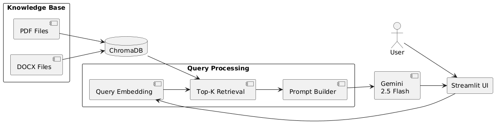

# Grounded Document Q&A Bot

An intelligent, context-grounded Retrieval-Augmented Generation (RAG) assistant designed to query local document libraries (specifically PDF and DOCX files) and return accurate, fully cited responses. It ensures absolute compliance with company documentation by strictly constraining the answer generation space to retrieved source context, preventing hallucinations.

---

## 🛠️ Tech Stack

This project leverages the following libraries, tools, and platforms:

- **Python (>= 3.10)**: Core programming language.
- **google-generativeai (>= 0.3.0)**: SDK for accessing Google's Gemini Models for embedding generation and natural language reasoning.
- **chromadb (>= 0.4.22)**: Serverless, in-memory/disk-persistent vector database to store and query text chunks and metadata.
- **pypdf (>= 4.0.0)**: Lightweight library for parsing text out of PDF files.
- **python-docx (>= 1.1.0)**: Document reader to process Microsoft Word (DOCX) files.
- **python-dotenv (>= 1.0.1)**: Environment variable manager to secure API keys.
- **streamlit (>= 1.30.0)**: Interactive web interface for control settings, file display, and real-time chatting.
- **tqdm (>= 4.66.0)**: Progress bar library for visualizing console-based ingestion.

---

## 📐 Architecture Overview

The system runs a classic Retrieval-Augmented Generation (RAG) pipeline consisting of an ingestion workflow and a querying workflow.

### The Ingestion Pipeline
1. **Document Discovery**: Scans the `data/` directory for files matching `.pdf` or `.docx`.
2. **Text Extraction**: Extracts plain text page-by-page.
3. **Chunking**: Splits pages into fixed-size overlapping text chunks.
4. **Embedding Generation**: Sends chunks to the Gemini embedding API to produce dense vector representations.
5. **Vector DB Storage**: Persists the embeddings, chunk texts, and metadata (source file and page number) in ChromaDB.

### The Query Pipeline
1. **Query Embedding**: The user's query is vectorized using the same embedding model.
2. **Semantic Retrieval**: ChromaDB performs a similarity search (Cosine Distance) to fetch the top `K` most relevant chunks.
3. **Context Construction**: Formats the retrieved text snippets and citations into a structured prompt.
4. **Grounded Answer Generation**: Gemini processes the prompt under strict system guidelines to formulate an answer using *only* the retrieved context.

Below is the system architecture diagram showing the components of this pipeline:



---

## 🧩 Chunking Strategy

### The Chosen Strategy
The pipeline implements a **Fixed-size Character Chunking with Overlap** strategy.
- **Chunk Size**: `800` characters (default, configurable).
- **Chunk Overlap**: `150` characters (default, configurable).

### Why this strategy was chosen:
1. **Context Continuity**: The 150-character overlap acts as a safety window to ensure key concepts and sentences that straddle the boundaries of a chunk are not truncated, keeping semantic concepts coherent.
2. **Retrieval Granularity**: A chunk size of 800 characters translates to roughly 120-150 words. This size is large enough to contain useful, standalone facts (e.g., an IT rule or a company value) but small enough to fit multiple chunks into the LLM's context window without overwhelming it with irrelevant text.
3. **Metadata Mapping**: Since documents are first read page-by-page, chunking tracks the exact page numbers (`page` key in metadata). When a chunk is retrieved, the bot knows precisely which page of which file it came from, allowing page-level citation.

---

## 🗃️ Embedding Model & Vector Database

### Embedding Model:
- **Model**: `models/text-embedding-004` (with fallback to `models/gemini-embedding-001`).
- **Why**: Google's text-embedding models offer high-quality semantic representations across a broad range of vocabulary. The API provides task-specific optimization options (e.g., `retrieval_document` during ingestion and `retrieval_query` during search), which tunes the embeddings specifically for matching user questions to document answers.

### Vector Database:
- **Database**: **ChromaDB** (Persistent disk client).
- **Why**:
  - **Serverless & Lightweight**: Stores data directly on the local filesystem in the `db/` directory, avoiding the overhead of hosting or paying for cloud vector databases.
  - **Embedded Metadata**: Easily stores and queries documents, IDs, and complex dictionary metadata (source filename, page numbers, chunk boundaries) side-by-side.
  - **Cosine Similarity**: Employs Cosine Distance metrics (`hnsw:space: cosine`), which are mathematically optimal for normalized semantic similarity comparisons.

---

## 🚀 Setup Instructions

Follow these step-by-step instructions to clone, install, and run the bot locally.

### Step 1: Clone the Repository
Clone the project repository to your local machine:
```bash
git clone <repository_url>
cd document-qa-bot
```

### Step 2: Set up a Virtual Environment
Create a virtual environment to manage dependencies:
```bash
python -m venv venv
source venv/bin/activate  # On Windows: venv\Scripts\activate
```

### Step 3: Install Dependencies
Install all required libraries using pip:
```bash
pip install -r requirements.txt
```

### Step 4: Configure Environment Variables
Create a file named `.env` in the root of the project and populate it:
```bash
touch .env
```
Add your configurations (refer to the [Environment Variables](#-environment-variables) section below for details).

### Step 5: Place Your Documents
Put the PDF or Word (`.docx`) files you want to query in the `data/` directory.

### Step 6: Ingest Documents
Process your document library to build the vector database index:
```bash
python -m src.ingest
```

### Step 7: Run the Application

You can interact with the bot in three ways:

#### A. Web Dashboard (Streamlit)
To run the interactive chat interface:
```bash
streamlit run app.py
```
Open `http://localhost:8501` in your browser. The UI allows you to search files, change retrieval size (`TOP_K`), re-ingest documents dynamically, and chat.

#### B. Command Line Interface (CLI)
To run a query from your terminal:
```bash
python -m src.main --query "What is the core working hours policy?"
```
To print the output as formatted JSON:
```bash
python -m src.main --query "What is the core working hours policy?" --json
```

#### C. Python REPL / API
Use the RAG pipeline inside your own scripts:
```python
from src.main import answer_question

result = answer_question("What is the core working hours policy?")
print(result["answer"])
print(result["sources"])
```

---

## 🔑 Environment Variables

The application reads configurations and API keys from a `.env` file in the project root. Create a `.env` file containing the following properties:

| Variable Name | Required | Description | Default / Example |
| :--- | :--- | :--- | :--- |
| `GOOGLE_API_KEY` | **Yes** | Your Google Gemini API Key. Can also use `GEMINI_API_KEY`. | `AIzaSyD...` |
| `CHROMA_COLLECTION_NAME`| No | The name of the collection inside ChromaDB. | `documents` |
| `CHUNK_SIZE` | No | Character count for each parsed document chunk. | `800` |
| `CHUNK_OVERLAP` | No | Overlapping character count between consecutive chunks. | `150` |
| `TOP_K` | No | Number of semantic chunks retrieved per question. | `4` |
| `EMBEDDING_MODEL` | No | Model name used for semantic embeddings. | `models/gemini-embedding-001` |
| `GENERATION_MODEL` | No | Model name used to generate the final response. | `gemini-2.5-flash` |

> [!WARNING]
> **Security Reminder**: Never commit your `.env` file or hardcode your API keys. The `.env` file is already listed in `.gitignore`.

---

## ❓ Example Queries

Below are five sample queries based on the default dataset, along with their expected answer themes:

### 1. Account Lockout Assistance
* **Query**: `How do I reset my password if I get locked out of my account?`
* **Expected Answer Theme**: Accounts lock automatically after 5 unsuccessful login attempts. The user must wait 15 minutes and retry, use the self-service portal's "Forgot Password" functionality completing Multi-Factor Authentication (MFA), or contact IT Support for escalation.
* **Relevant Source**: `it_support_faq.pdf` (Page 1)

### 2. Remote Work Rules
* **Query**: `What are the eligibility requirements and core hours for remote work?`
* **Expected Answer Theme**: Remote work requires manager approval and completing at least 3 months of employment. Remote employees must be available during core hours of 10 AM to 4 PM and respond to messages within one hour during working hours.
* **Relevant Source**: `remote_work_guidelines.docx`

### 3. Equipment Loss Policy
* **Query**: `What should I do if my company laptop is lost or stolen?`
* **Expected Answer Theme**: Employees must report the lost device within 1 hour of discovery. The Security Team will disable access, revoke active sessions, and start tracking procedures.
* **Relevant Source**: `it_support_faq.pdf` (Page 2)

### 4. Employee Attendance and Leave
* **Query**: `What is the minimum monthly attendance rate expected of employees, and how do they request leave?`
* **Expected Answer Theme**: Employees are expected to maintain a minimum monthly attendance rate of 95%. To request leave, they must submit a request through the HR portal, obtain manager approval, and receive confirmation from HR.
* **Relevant Source**: `EmployeeHandbook.pdf` (Page 3)

### 5. Security Incident Reporting
* **Query**: `What are some examples of security incidents, and what is the response target time?`
* **Expected Answer Theme**: Security incidents include phishing, malware, lost devices, unauthorized access, and data leakage. The policy targets a response time of 8 hours.
* **Relevant Source**: `security_policy.pdf` (Pages 3 & 4)

---

## ⚠️ Known Limitations

1. **Strict Context Constraints (No General Knowledge)**:
   The bot is strictly instructed to answer *only* using retrieved document context. If a user asks a general question (e.g., "What is the capital of France?"), the bot will reply with a variation of: *"I am sorry, but the provided documents do not contain the answer to your question."*
2. **Text-Only Extraction**:
   The parser uses `pypdf` and `python-docx`, which only extract raw unicode text. Any information structured inside complex image formats, diagrams, scanned PDFs, page layouts, or handwritten signatures is ignored.
3. **No Native Table Semantic Alignment**:
   Standard character chunking splits text line-by-line, which breaks markdown or whitespace-aligned tables. Questions relying on detailed tabular lookups might fetch disjointed text, leading to generation gaps.
4. **No Chat History Persistent State in Pipeline Backend**:
   The core RAG query logic (`query_rag_pipeline`) is stateless. Each query is treated as a separate turn. While the Streamlit UI retains visual chat history for display, previous turns are not passed to the retrieval/generation pipeline for subsequent follow-up queries.
5. **Fixed-Size Chunking Semantics**:
   Fixed character limits (e.g., 800) do not respect sentence or paragraph boundaries. This can sometimes divide a single coherent point into two separate chunks, potentially lowering its similarity retrieval score.
